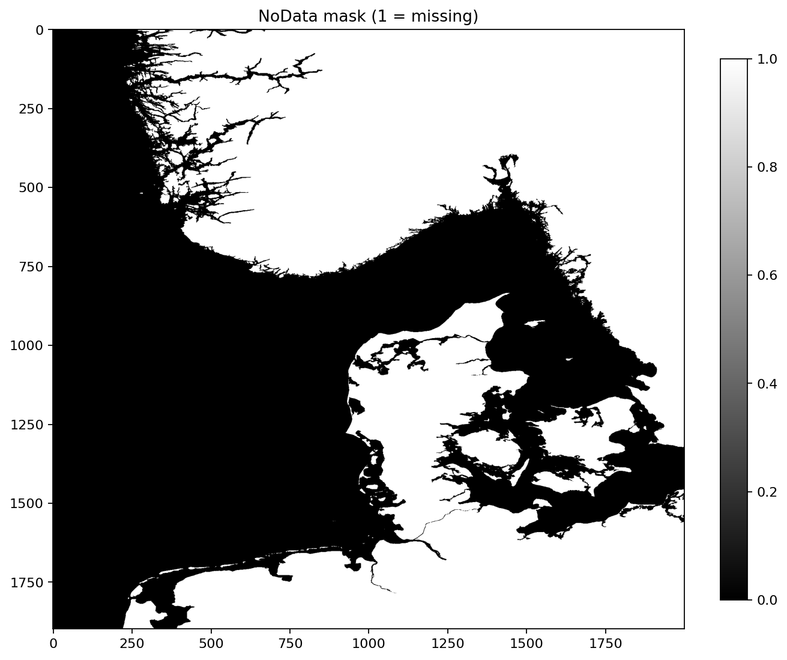
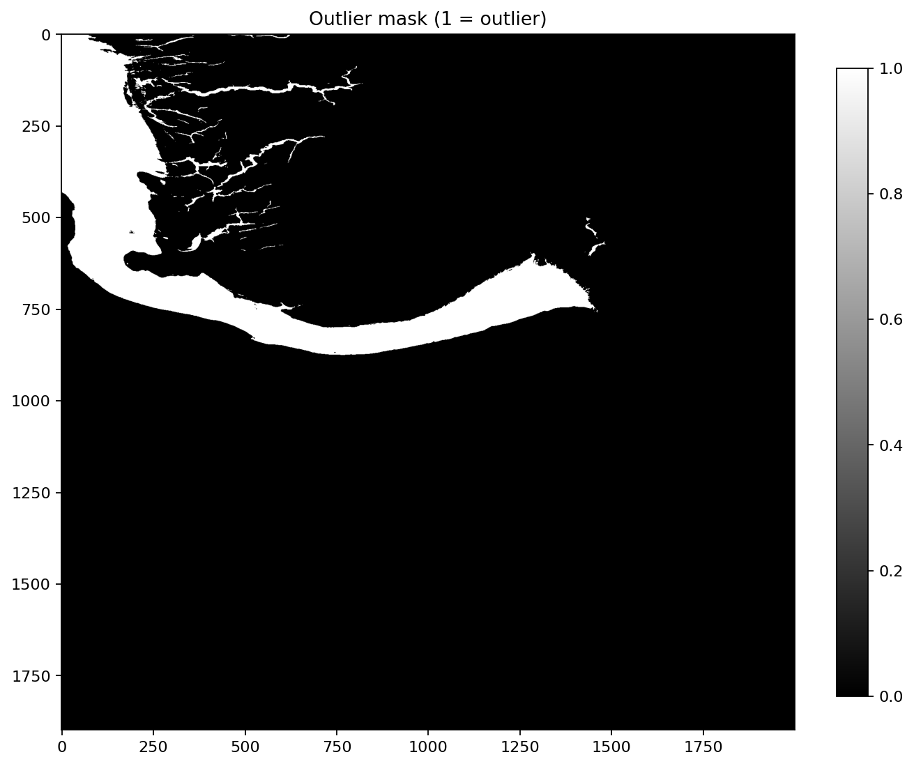
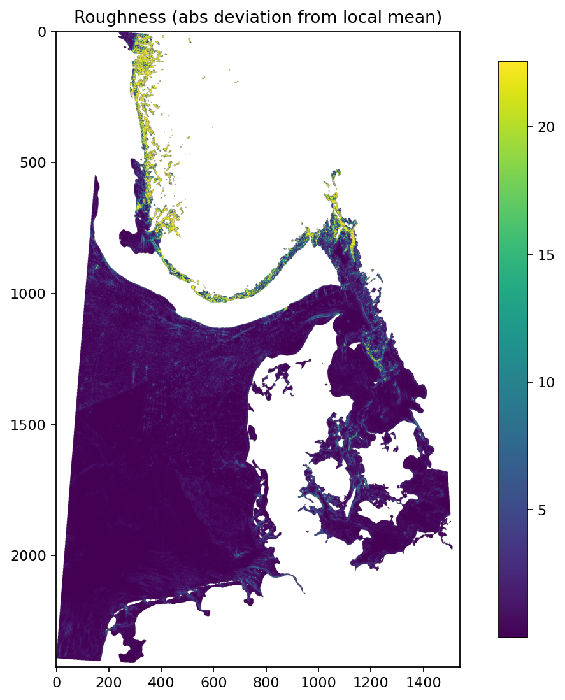

# HydroQC Mini Report

## Input
- File: `D5_2024.tif`
- CRS: `EPSG:4326`
- Raster size: 9484 x 9004
- Bounds (in CRS units): (3.497916666666667, 52.49791666666667, 13.377083333333333, 61.87708333333333)
- Data type: float32
- NoData: nan

## Parameters
- Outlier MAD z-threshold: 6.0
- Roughness window: 9
- Roughness min valid fraction: 0.6
- Roughness clip percentile (plot): 99.0
- Max plot dimension (downsample): 2000
- UTM CRS used for slope/roughness: `EPSG:32632`

## Quick QC metrics (global, streamed)
- Valid pixels: 47.14%
- Min depth: -1276.3399658203125
- Max depth: 23.780000686645508
- Mean depth: -98.13913317941586
- Std depth: 126.93986149922651

## Missing data (downsample view)
- Connected missing regions (count): 1063
- Largest missing region (pixels, downsample): 1187737
- Downsample shape: 2000 x 1899

## Figures

